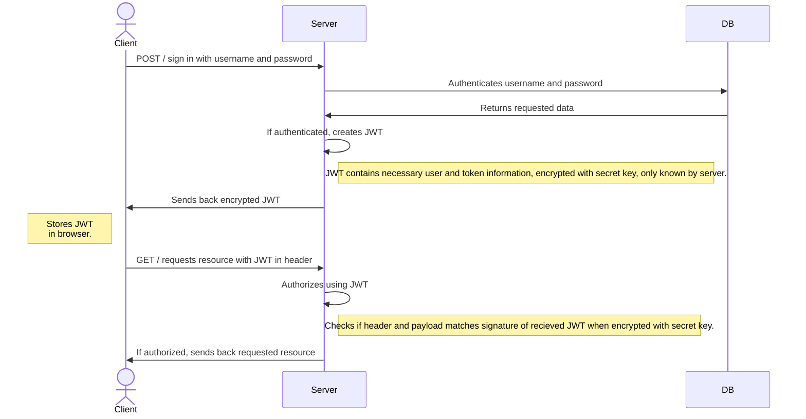

# One Source

## TTFHW - Instructions
### Backend developer
```
cd <your-workspace>
git clone https://github.com/nillali/heroku-test.git    
cd heroku-test
touch .env
npm install
npm start
``` 
Add this code to your .env file:
```
dbURI=<your MongoDB connection string>
``` 

### Tester  
Unit test
```
npm test  
```
Component test  
```
npm componenttest  
```
Integration test
```
npm integrationtest  
``` 



## Test
